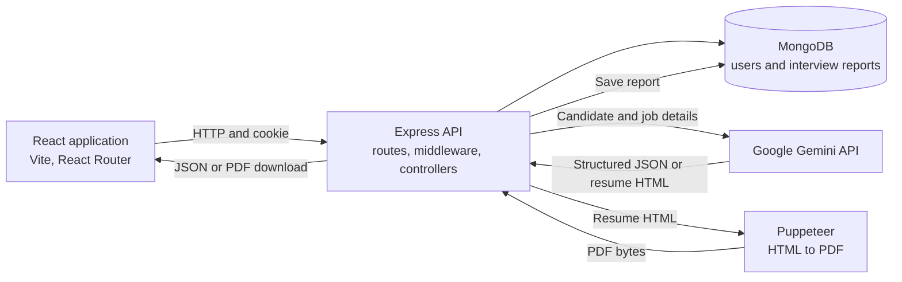

# Interview.ai

Interview.ai is a web app for preparing for job interviews. A signed-in user provides a target job description and their resume/profile, then the app uses Google Gemini to build a personalized interview report. The report includes a match score, technical and behavioral questions, answer guidance, skill gaps, and a preparation roadmap. From a report, the user can also generate and download an AI-tailored resume as a PDF.

## Contents

- [Features](#features)
- [Architecture](#architecture)
- [Interview report flow](#interview-report-flow)
- [Resume PDF flow](#resume-pdf-flow)
- [Data model](#data-model)
- [API routes](#api-routes)
- [Run locally](#run-locally)
- [Environment variables](#environment-variables)
- [Project structure](#project-structure)
- [Current limitations](#current-limitations)

## Features

- Register and log in with a username, email, and password.
- Keep a signed-in session with a JWT cookie and log out by invalidating the token.
- Submit job and candidate information to generate an AI interview report.
- Review technical and behavioral questions, their intent, and suggested answers.
- Review a role match score, skill gaps, and a day-by-day preparation plan.
- Reopen recent reports saved to the signed-in user's account.
- Generate and download a tailored resume PDF.
- Use public About, Help, Privacy Policy, and Terms pages.
- Responsive dark-themed interface.

## Architecture

The repository has a React/Vite frontend and an Express/MongoDB backend. The frontend calls the backend over HTTP. Protected API calls send the authentication cookie using Axios `withCredentials`.



### Frontend

- `Frontend/src/main.jsx` starts React and imports global styles.
- `Frontend/src/App.jsx` provides the shared auth and interview contexts and the router.
- `Frontend/src/app.routes.jsx` defines the login, register, protected home/report, and public information pages.
- `Frontend/src/features/auth` contains auth state, API calls, forms, protected-route handling, and logout.
- `Frontend/src/features/interview` contains the home form, report display, interview API, report context, and page styles.
- `Frontend/src/components/LoadingState.jsx` provides the themed loading UI.

### Backend

The backend starts in `Backend/server.js`. It loads environment variables, connects to MongoDB, and starts the Express app on port `3000`. `Backend/src/app.js` installs JSON, cookie, and CORS middleware, then mounts the route modules.

Requests generally pass through these layers:

1. A route matches the HTTP method and path.
2. Protected routes run `auth.middleware.js` to validate the JWT cookie and check the token blacklist.
3. A controller handles request data and persistence.
4. A service performs work such as calling Gemini or rendering a PDF.
5. A Mongoose model reads or writes MongoDB data.

## Interview report flow

1. The user fills in a job description and profile information on the home page and selects **Generate My Interview Plan**.
2. The frontend submits a `multipart/form-data` request containing `jobDescription`, `selfDescription`, and a `resume` file to `POST /api/interview/`.
3. The route checks the user's JWT cookie and passes the uploaded file through Multer. Multer keeps the file in memory and limits it to 3 MB.
4. The interview controller extracts text from the uploaded PDF with `pdf-parse`.
5. `ai.service.js` combines the extracted resume text, self-description, and job description into a Gemini prompt.
6. The service requests JSON output using a Zod-derived JSON schema. The expected result contains:
   - `title` and `matchScore`
   - `technicalQuestions` and `behavioralQuestions`, each with a question, intention, and answer guidance
   - `skillGaps` with a low, medium, or high severity
   - `preparationPlan` with a day, focus, and tasks
7. The service parses Gemini's response text as JSON. It tries these report models in order: `gemini-3.8-flash`, `gemini-3.7-flash`, `gemini-3.6-flash`, then `gemini-3.5-flash`. For temporary `500`, `503`, or `429` errors it tries the next model; other errors are rethrown immediately.
8. The controller saves the report and its source text in MongoDB, associated with the current user, and returns the created report.
9. The frontend navigates to `/interview/:interviewId`. The report page fetches the saved report and displays the sections, score, and skill gaps.

## Resume PDF flow

The **Download Resume** button generates a tailored resume PDF from the source information saved with an interview report. It does not download the interview report itself.

1. The frontend sends `POST /api/interview/resume/pdf/:interviewReportId` with the session cookie.
2. The backend loads the saved resume text, self-description, and job description for that report.
3. `generateResumePdf()` asks `gemini-3-flash-preview` for a JSON response with one `html` field. Its prompt requests a concise, professional, ATS-friendly resume tailored to the role.
4. The backend parses the JSON response and gives the HTML to Puppeteer.
5. Puppeteer creates a browser page, sets the generated HTML as its content, and renders an A4 PDF with 10 mm margins.
6. The API responds with `application/pdf` bytes and an attachment filename. The frontend receives a Blob and starts a browser download.

## Data model

### User

The `users` collection stores a unique username, unique email, and bcrypt-hashed password. Login returns a JWT in a cookie; the JWT expires after one day. Logout adds the current token to the `blacklistTokens` collection and clears the cookie.

### Interview report

The `InterviewReport` collection stores:

- The owning user and generated job title.
- The job description, extracted resume text, and self-description.
- The match score, technical and behavioral questions, skill gaps, and preparation plan.
- `createdAt` and `updatedAt` timestamps.

The report-list API omits source text and detailed report sections to keep the recent-reports response smaller. A single-report request returns the full report.

## API routes

All routes use the backend origin `http://localhost:3000`. Routes marked **Protected** require the JWT cookie.

| Method | Path | Access | Purpose |
| --- | --- | --- | --- |
| `POST` | `/api/auth/register` | Public | Create a user account. Request JSON: `username`, `email`, `password`. |
| `POST` | `/api/auth/login` | Public | Verify credentials and set the JWT cookie. Request JSON: `email`, `password`. |
| `GET` | `/api/auth/logout` | Public | Blacklist the current token and clear its cookie. |
| `GET` | `/api/auth/get-me` | Protected | Return the current user's basic details. |
| `POST` | `/api/interview/` | Protected | Generate and save a report from multipart fields `jobDescription`, `selfDescription`, and `resume`. |
| `GET` | `/api/interview/` | Protected | List the current user's recent reports. |
| `GET` | `/api/interview/report/:interviewId` | Protected | Fetch one report owned by the current user. |
| `POST` | `/api/interview/resume/pdf/:interviewReportId` | Protected | Generate and download a tailored resume PDF. |

## Run locally

You need Node.js/npm and a reachable MongoDB database. The backend and frontend run in separate terminals.

### 1. Configure the backend

Create `Backend/.env` and set the variables described in [Environment variables](#environment-variables). Keep this file private and do not commit it.

```powershell
cd Backend
npm install
npm run dev
```

The backend listens on `http://localhost:3000`. Its `dev` script runs `npx nodemon server.js`; if nodemon is not available, run `node server.js`.

### 2. Start the frontend

In another terminal:

```powershell
cd Frontend
npm install
npm run dev
```

Vite serves the app at `http://localhost:5173` by default. The backend CORS configuration currently allows that origin.

### 3. Build or lint the frontend

```powershell
cd Frontend
npm run build
npm run lint
```

`npm test` in the backend is currently a placeholder and does not run a test suite.

## Environment variables

Set these in `Backend/.env`:

| Variable | Purpose |
| --- | --- |
| `MONGO_URI` | MongoDB connection string. |
| `JWT_SECRET` | Secret used to sign and verify login tokens. Use a long, random value. |
| `GOOGLE_GENAI_API_KEY` | API key used by `@google/genai` to call Gemini. |

Example shape (replace each placeholder locally; do not commit real credentials):

```dotenv
MONGO_URI=mongodb://127.0.0.1:27017/interview-ai
JWT_SECRET=replace-with-a-long-random-secret
GOOGLE_GENAI_API_KEY=your-google-genai-api-key
```

## Project structure

```text
.
├── Backend/
│   ├── server.js
│   └── src/
│       ├── app.js
│       ├── config/          # MongoDB connection
│       ├── controllers/     # Auth and interview request handlers
│       ├── middlewares/     # JWT authorization and file upload
│       ├── models/          # User, report, and blacklisted-token schemas
│       ├── routes/          # Express route definitions
│       └── services/        # Gemini report and PDF generation
└── Frontend/
    ├── index.html
    └── src/
        ├── app.routes.jsx
        ├── App.jsx
        ├── components/
        └── features/
            ├── auth/
            └── interview/
```

## Current limitations

- **Resume upload behavior needs alignment:** the frontend file picker advertises PDF and DOCX, but the backend uses `pdf-parse`, which expects PDF content. The backend also allows 3 MB while the frontend copy advertises a larger limit.
- **Resume input is required by the current controller:** although the interface describes a resume or self-description, the controller immediately reads `req.file.buffer`. A request with only a self-description will fail unless the backend is updated to handle a missing file.
- **PDF report ownership check:** report details are queried by both report ID and current user, but the resume-PDF controller currently looks up the report by ID alone. Add the same owner filter before using this endpoint in a multi-user deployment.
- **Local service URLs:** the frontend Axios clients use `http://localhost:3000`, and backend CORS allows `http://localhost:5173`. Update these for deployment.
- **Authentication hardening:** the JWT cookie is set without explicit `httpOnly`, `secure`, or `sameSite` options. Configure appropriate cookie flags and HTTPS for production.
- **Email verification:** registration checks for required values and duplicate accounts but does not currently validate email format on the backend or verify mailbox ownership.
- **AI output:** generated scores and suggestions can be inaccurate or incomplete. Treat them as preparation guidance and review them before use.
- Resume text, job descriptions, and self-descriptions are sent to Gemini for generation and saved in the associated report in MongoDB. Avoid submitting information you do not want processed or stored.
